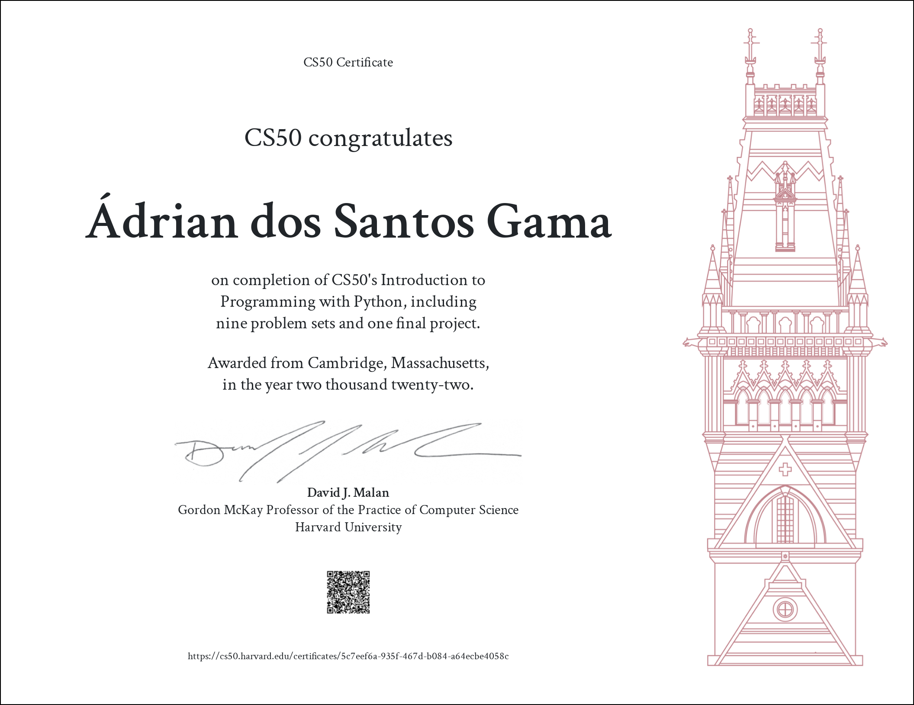

# CS50’s Introduction to Programming with Python (2022)

Before read this repository files, remember the [Academic Honesty](https://cs50.harvard.edu/x/honesty/).\
These files serve to give you a sense of how to do, iff, you feel lost in solving the problem.\
Don't copy and paste any of these files, try to solve any problems by yourself.

## Submitions

* Functions, Variables
    * [Indoor Voice](week0/indoor/indoor.py)
    * [Playback Speed](week0/playback/playback.py)
    * [Making Faces](week0/faces/faces.py)
    * [Einstein](week0/einstein/einstein.py)
    * [Tip Calculator](week0/tip/tip.py)
* Conditionals
    * [Deep Thought](week1/deep/deep.py)
    * [Home Federal Savings Bank](week1/bank/bank.py)
    * [File Extensions](./week1/extensions/extensions.py)
    * [Math Interpreter](week1/interpreter/interpreter.py)
    * [Meal Time](week1/meal/meal.py)
* Loops
    * [camelCase](week2/camel/camel.py)
    * [Coke Machine](week2/coke/coke.py)
    * [Just setting up my twttr](week2/twttr/twttr.py)
    * [Vanity Plates](week2/plates/plates.py)
    * [Nutrition Facts](week2/nutrition/nutrition.py)
* Exceptions
    * [Fuel Gauge](week3/fuel/fuel.py)
    * [Felipe's Taqueria](week3/taqueria/taqueria.py)
    * [Grocery List](week3/grocery/grocery.py)
    * [Outdated](week3/outdated/outdated.py)
* Libraries
    * [Emojize](week4/emojize/emojize.py)
    * [Frank, Ian and Glen’s Letters](week4/figlet/figlet.py)
    * [Adieu, adieu](week4/adieu/adieu.py)
    * [Guessing Game](week4/game/game.py)
    * [Little Professor](week4/professor/professor.py)
    * [Bitcoin Price Index](week4/bitcoin/bitcoin.py)
* Unit Tests
    * [Testing my twttr](week5/test_twttr/test_twttr.py)
    * [Back to the Bank](week5/test_bank/test_bank.py)
    * [Re-requesting a Vanity Plate](week5/test_plates/test_plates.py)
    * [Refueling](week5/test_fuel/test_fuel.py)
* File I/O
    * [Lines of Code](week6/lines/lines.py)
    * [Pizza Py](week6/pizza/pizza.py)
    * [Scourgify](week6/scourgify/scourgify.py)
    * [CS50 P-Shirt](week6/shirt/shirt.py)
* Regular Expressions
    * [NUMB3RS](week7/numb3rs/numb3rs.py)
    * [Watch on YouTube](week7/watch/watch.py)
    * [Working 9 to 5](week7/working/working.py)
    * [Regular,um,Expressions](week7/um/um.py)
    * [Response Validation](week7/response/response.py)
* Object-Oriented Programming
    * [Seasons of Love](week8/seasons/seasons.py)
    * [Cookie Jar](week8/jar/jar.py)
    * [CS50 Shirtificate](week8/shirtificate/shirtificate.py)
* [Final Project](https://github.com/jusqua/roguelikey)

## Certificate

